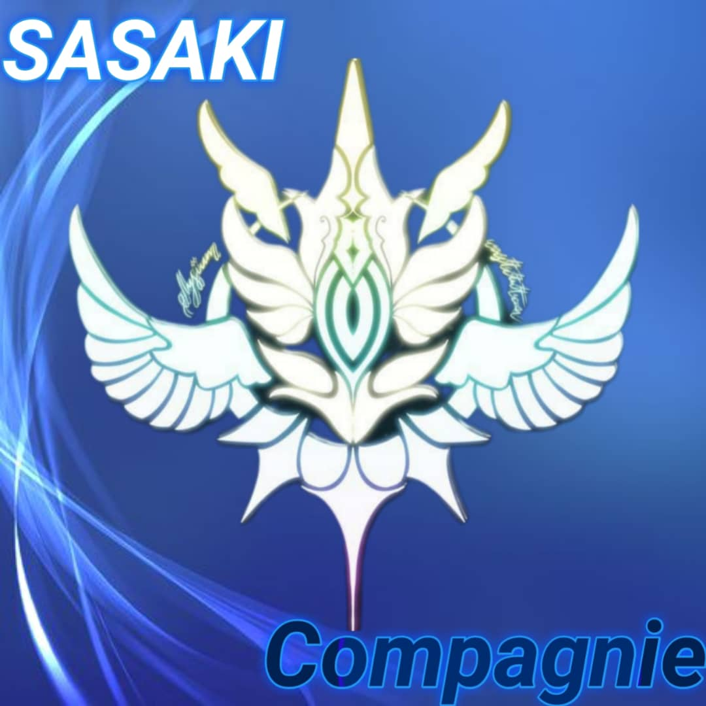

<h1>SSK-COMPAGNY </h1>  

 SSK-CAMPAGNY est une entreprise spécialisée dans la programmation éthique, l'informatique , développement  AI , le hacking et certains domaines d'informatique élevé. 

## Fonctionnalités Principales

- **cours surs les langues :** vous avez la possibilité d'apprendre les languages de programmation comme (html css javascript php c c+ python ) via notre chaine whatsapp youtube groupe support, vous êtes assisté tout le long de la formation par nos membres.

- **Guide ou oritentation :** Grâce à notre équipe vous avez les garanties d'être suivi de près à chaque fois que vous entamez une nouvelle étape de le codage programmation et développement.

## Fonctionnalités Ludiques

## Moyens de communication

1. Veillez cliquer sur **[Support Group](https://chat.whatsapp.com/IdB2EfQiNlKBekQrigN9m9)** Afin de vous rendre directement dans le groupe de discussion où vous pourrez discuter directement avec les administrateurs. 

2. Obtenez les liens des chaines  :  
  
[Chaine-whatsapp](https://whatsapp.com/channel/0029Vajrhmz96H4IsEjh4a41)   
[Chaine-youtube](https://www.youtube.com/@SSK-FAMILYCAMPAGNY)  
  

## Liens vers le site web
- **SSK-siteWeb**
  1.  Si vous comptez vous rendre sur notre site web cliquez [**ici**](https://ssk-campagny-tech-lwigvv2.gamma.site/) .Pour vous y rendre directement

  2.  Mais il se peut que vous ayez des questions si vous trompe sur la tête mais vous n'êtes plus de la possibilité de nous joindre nous mettons à disposition cette IA cliquez [**ici**](https://barnaclestudios.com/chat/e/65d91c16-ff58-4537-b865-8137642872ef) .conversation rapide 

## Contributions

Les contributions à sasaki-compagnie sont les bienvenues ! Si vous avez des idées pour de nouvelles fonctionnalités, des améliorations ou des corrections de bogues, n'hésitez pas à ouvrir une issue ou à soumettre une demande de pull 

Nous remercions certaines personnes pour leur contribution :

**Meldkilg** qui a s'occupe d'un des plus gros projet de la compagnie ;  

**Door** qui est chargé de la maintenance;

**Allan** qui c'est beaucoup insvestis dans la creation de notre premier site web

**Alp24ni** qui est toujours pour reglé les erreurs et qui s'occupe aussi du developpement de l'IA;

┏━━━━━━━━━━━━━━
┃ COURS, CONSEIL 
┃ORIENTATION,HELP
┃ASSISTANCE,
┃
┗━━━━━━━━━━━━━━━
                
## Licence

Le Bot WhatsApp Zokou est publié sous la [Licence MIT](https://opensource.org/licenses/MIT).

vous l'aurez compris  
SSK-CAMPAGNY forment ces membres et utilisateurs dans les domaines telles que L'apprentissage du codage HTML, CSS et python ; Les cours sur le piratage éthique et concepts ; cours sur le développement et le déploiement des Bots WhatsApp sur Github et toutes ses plateformes ; les cours sur les réseaux d'information ,les activités légales et les statistiques variable de tout ce qui est liés a l'informatique.

## Developpeur :
 
nous preferons les garder secret pour le moment

  [**SASAKI-POSTE1**](https://github.com/SASAKI-POSTE1/SSK-COMPAGNY/)   
 
 
